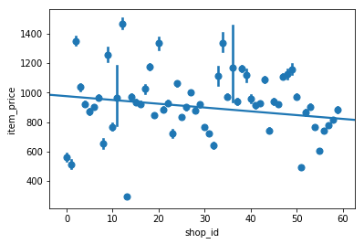
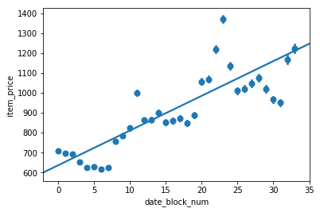

In this project, I try to predict future sales by using dataset provided by "Predict Future Sales
Final project for "How to win a data science competition" Coursera course" in [kaggle competition](https://www.kaggle.com/c/competitive-data-science-predict-future-sales)

It was a challenge since Test data consists of only 3 columns while Train data was consisting of 6 columns including target column.

In order to solve this problem, I tried to predict missing columns in Test dataset step by step first, then I predict future sales using provided columns together with predicted columns. 
In other words, I used 2 predicted (predicted by using 3 existing columns) and 3 already provided columns to predict Future Sales at the end.

Here is some figures about some columns vs target (Item Price) in Train dataset.

